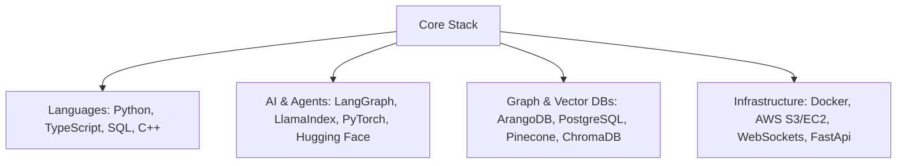

# ⚡ Nitij Taneja

### **AI Researcher & Autonomous Systems Architect**

 

  
  
  

 

---

## 🔭 About Me & Academic Vision

I am a final-year **Integrated M.Tech student in Computer Science (Data Science & Computational Thinking ) at VIT Bhopal University (CGPA: 8.44/10.0)**, targeting Ph.D. admissions for **Fall 2027**.

My research bridges **Autonomous Multi-Agent Reasoning, Knowledge Graph Grounding (GraphRAG), and Cognitive AI**. Unlike traditional prompt engineering, my work focuses on building robust, hallucination-resistant architectures where agents deliberate over typed relational graphs and verifiable reasoning topologies.

- 🔬 **Key Research:** First-author paper accepted at **IEEE INSTCon 2026** on Multi-Agent GraphRAG over statutory frameworks (0% context drift achieved across 100 queries). Co-authored research published in the *Journal of Decision Making and Healthcare (2026)* on Spatio-Temporal Deep Learning.

- 🛠️ **Industry Impact:** Built production-grade GraphRAG engines at **GoPluto.ai** (reducing retrieval latency by 40%) and led LLM reasoning pipelines at **ApexIQ AI**.

- 🏆 **Notables:** Top 2% among 10,000+ registrations at IIT Kharagpur Data Science Hackathon; Rank 23 Nationally in Zelestra x AWS ML Ascend Challenge.

---

## 🚀 Featured Agentic AI & RAG Demos

> *All project GIFs, demos, and architectures are fully preserved and linked below to showcase real-time multi-agent reasoning and observability.*

<table width="100%">
<tr>
  <td width="50%" align="center">
    <b>🏛️ A2A Legal Research & GraphRAG</b>  

    <i>Multi-agent protocol simulating legal deliberation with 0% statutory drift.</i>  
  

      

    <a href="https://github.com/nitij-taneja/A2A_LEGAL_RESEARCH"><b>[Repository & Code]</b></a>
  </td>
  <td width="50%" align="center">
    <b>🧠 GraphRAG Knowledge Engine</b>  

    <i>Typed non-Euclidean graph retrieval integrated with Google Gemini.</i>  
  

      

    <a href="https://github.com/nitij-taneja/graph_rag"><b>[Repository & Code]</b></a>
  </td>
</tr>
<tr>
  <td width="50%" align="center">
    <b>🔍 Deep Research AI Agent</b>  

    <i>LangGraph-Gemini parallel multi-stage workflow with live observability.</i>  
  

      

    <a href="https://github.com/nitij-taneja/deep-research-ai-agent"><b>[Repository & Code]</b></a>
  </td>
  <td width="50%" align="center">
    <b>📊 ReAct RAG Visualizer</b>  

    <i>Real-time WebSocket tracing of agentic reasoning and thought loops.</i>  
  

      

    <a href="https://github.com/nitij-taneja/react_rag_visualiser"><b>[Repository & Code]</b></a>
  </td>
</tr>
<tr>
  <td width="50%" align="center">
    <b>💰 FinSight AI (Multi-Agent )</b>  

    <i>Real-time financial intelligence powered by collaborative agent teams.</i>  
  

      

    <a href="https://github.com/nitij-taneja/FinSight-AI"><b>[Repository & Code]</b></a>
  </td>
  <td width="50%" align="center">
    <b>📰 The AI Samachar</b>  

    <i>Autonomous multi-agent team curating personalized live newsletters.</i>  
  

      

    <a href="https://github.com/nitij-taneja/The-AI-Samachar"><b>[Repository & Code]</b></a>
  </td>
</tr>
</table>

---

## 💻 Core Technical Stack

  
  
  
  
  
  
  
  

---

## 📊 GitHub Analytics & Contributions

 

  
  

 

  

---

## 🤝 Connect & Collaborate

  
  
  
  

